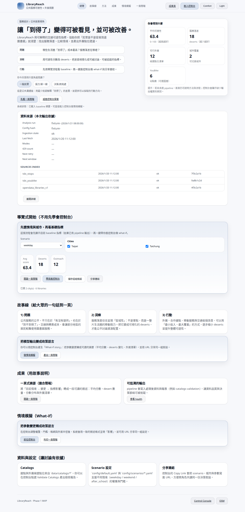
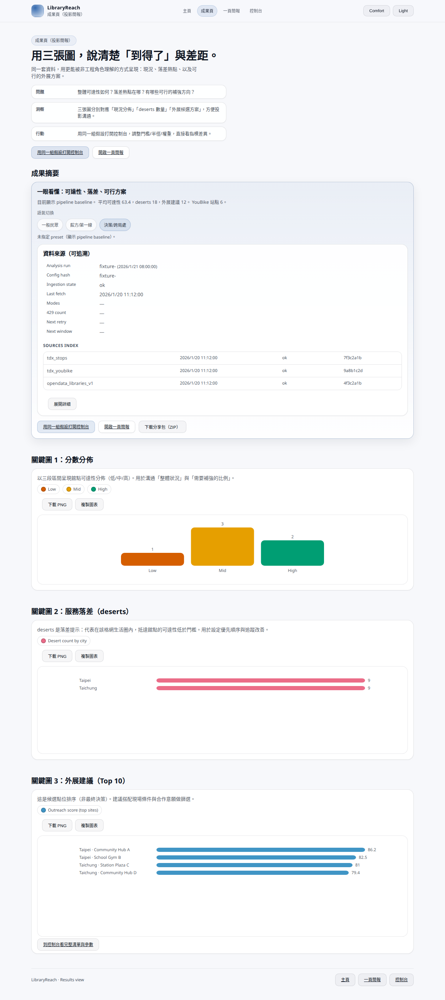
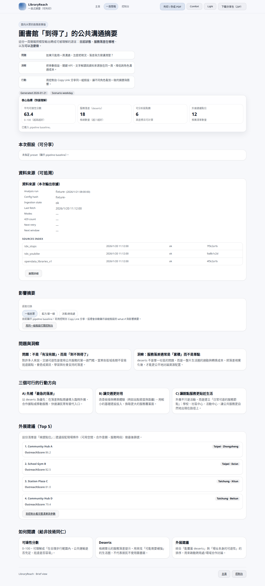
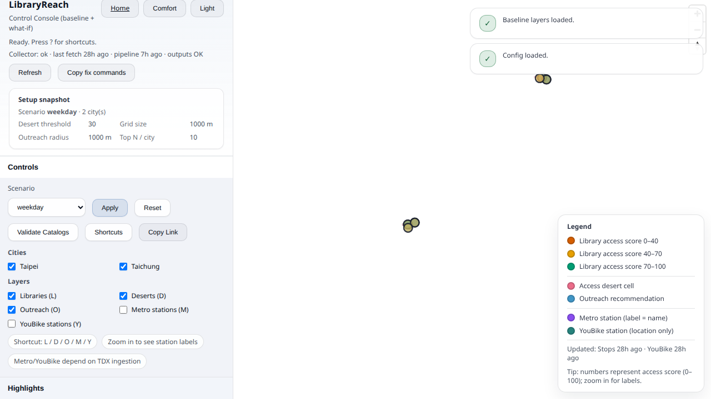
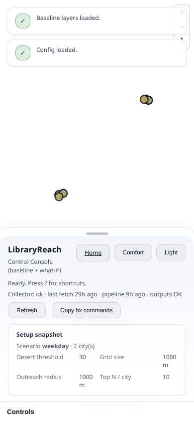

# LibraryReach

LibraryReach is a narrative-first, public-policy-style dashboard for **library accessibility** and **outreach planning**.
It turns transit accessibility signals into explainable KPIs, maps, and a shareable brief.


## Demo links

- Home: `/`
- Results: `/results`
- Brief: `/brief`
- Console: `/console`
- Method: `/method`

## Gallery (deterministic demo data)












## What’s inside (recent highlights)

- Narrative-first UX: unified hero + typography + story blocks (Problem → Insight → Action).
- Projection-ready results: 3 key charts, consistent map palette, copy/download tools.
- Control console upgrades: spotlight mode, clearer legend, action drawer feedback, library labels.
- Mobile experience: console controls become a draggable bottom sheet + sticky CTAs on content pages.
- Data provenance: run/source cards for traceability.
- Deterministic fixture mode for demos/tests: `LIBRARYREACH_E2E_FIXTURES=1`.

## Run locally

### Option A: Docker (recommended)

```bash
docker compose up -d --build api
open http://127.0.0.1:${LR_HOST_PORT:-8001}/
```

### Option B: Run API directly

```bash
python -m venv .venv
source .venv/bin/activate
pip install -e ".[dev]"
uvicorn libraryreach.api.main:app --reload --host 127.0.0.1 --port 8001
```

## Tests (unit + Playwright + screenshots)

### 1) Install Playwright

```bash
npm install
npx playwright install --with-deps
```

### 2) Run everything (pytest + Playwright + README update)

```bash
npm run test:all
```

### One-liner (bash)

```bash
./scripts/test_all.sh
```

### 3) Generate screenshots only

```bash
npm run e2e:screenshots
python scripts/update_readme.py
```

### Reports

- Playwright HTML report: `reports/playwright-report/index.html`
- Playwright artifacts: `reports/playwright-results/`
